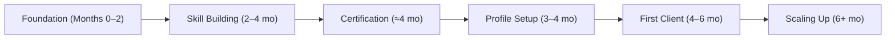
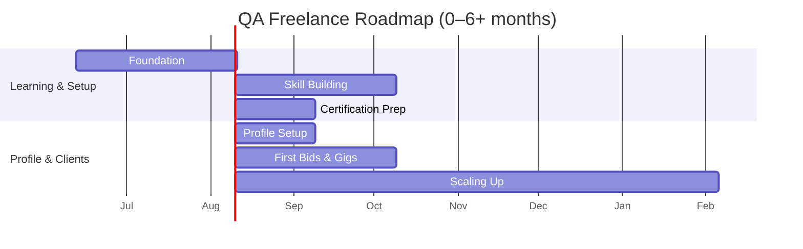

**TL;DR:** The remote QA/testing job market is growing. Remote QA roles (especially automation/SDET) are in high demand across tech, fintech, health, and e-commerce. Freelance platforms like Upwork and Fiverr have thousands of QA jobs, but competition is intense; specialized networks (Toptal, niche boards) favor experienced testers. Typical freelance QA rates range roughly $5–$30/hr (manual vs. automation), and full-time remote QA salaries range ~$50K–$130K/yr depending on level. Bangladeshi freelancers often charge lower rates ($5–$15/hr) and get paid via Payoneer or local transfers. Key skills include test case design, bug reporting, and tools (JIRA, Selenium, Postman, etc.), with certifications like ISTQB (Foundation/Advanced) as useful resume boosters. Beginners should build a portfolio (sample test plans, bug reports, simple automation scripts) and create strong Upwork/Fiverr profiles (clear summary, listed services, tools known). Beware common pitfalls: underpricing, unfocused proposals, or scams (e.g. $5/hr jobs, off-platform requests). Our roadmap (Phase 1–6) outlines 0–6+ months of learning, practice projects, profile setup, and client acquisition steps (including sample budgets and timelines), so you can, *Insha’Allah*, land your first paid QA gig within ~4–6 months of disciplined effort. 

# 1. Market Overview 
- **Global Demand (2024–2026):** QA/testing roles are projected to grow strongly. The U.S. Bureau of Labor Statistics forecasts 15% growth for QA analysts/testers by 2034 (much faster than average).  Industry reports show the automation/QA market has ~16–17% CAGR.  Notably, a majority of new QA jobs are remote-eligible: 60–75% of new QA roles in North America/Europe are advertised as remote (2026).  For example, one analysis finds senior QA positions are 80%+ remote nowadays.  
- **Growth Trends:** Remote QA hiring is rising fastest in emerging markets.  Annual hiring increases are roughly **3–5%** in NA/EU, **6–9%** in Eastern Europe, **8–12%** in Latin America, and ~**5–8%** in India/South Asia. A mermaid chart of **Region vs Hiring Index (2023=100)** illustrates this (below). The overall market outlook is positive: “playwright postings tripled 2024–26, Cypress plateaued, and the automation testing market is projected to grow”. 

- **Industries:** Tech companies across **SaaS, fintech, e-commerce, healthtech, and mobile apps** heavily hire remote QA testers.  For example, QA engineers are sought in healthcare startups and finance platforms; one guide notes remote QA roles in “fintech, healthcare, and e-commerce” are particularly abundant. Other sectors (e.g. gaming, IoT, blockchain) also use remote QA. 

# 2. Platforms & Marketplaces 

| **Platform**            | **QA Category Viable?**      | **Work Types**            | **Beginner Difficulty** | **Competition** |
|-------------------------|------------------------------|---------------------------|------------------------|-----------------|
| **Upwork**              | High – thousands of QA jobs  | Hourly, Fixed-price gigs, Long-term contracts, Part-time | High (many applicants) | Very high (global pool) |
| **Fiverr**              | Yes – QA Testing gigs exist  | Gig/fixed-price services  | Moderate (easy to join, hard to rank) | Very high (many sellers) |
| **Freelancer.com**      | Yes (~5,000+ QA jobs) | Hourly, Fixed, Contests   | High                    | High            |
| **Toptal**              | QA category (SDET focus)     | Long-term contracts, high-end jobs | Very high (requires screening) | Low (elite only) |
| **LinkedIn (Jobs)**     | N/A (Job board)              | Full-time/contract remote roles | High (formal hiring process) | High (crowded) |
| **PeoplePerHour**       | Yes (software testing section)| Hourly, Fixed contracts   | Moderate               | Moderate        |
| **Guru**                | Yes (few postings) | Hourly, Fixed            | Moderate (fewer jobs)  | Low–moderate    |
| **Remote.co**           | Yes (remote job listings) | Full-time remote, freelance | High (roles often senior) | Moderate        |
| **We Work Remotely**    | Yes (QA category) | Full-Time (mostly)       | High (companies expect experience) | High        |
| **Other Job Boards** (FlexJobs, RemoteOK, AngelList, etc.) | Many list QA roles     | Full-time, contract, freelance | High                | Moderate        |

- **Notes:** Upwork and Freelancer have large QA communities (Upwork shows ~875 QA Tester jobs). Fiverr has many fixed-price QA/testing “gigs.” Toptal/Arc cater to senior testers (after rigorous vetting). LinkedIn/Remote.co/WWR are best for salaried remote QA positions, not micro-gigs. PeoplePerHour/Guru have some QA jobs but much fewer.  Beginners often start on Upwork/Fiverr; competition is stiff, so a standout profile and niche (e.g. mobile app testing) help. Platforms like FlexJobs or AngelList may surface startup QA roles (full-time). 

# 3. Salary and Rates 

| **Role/Type**                | **Minimum**       | **Average**         | **Maximum**        | **Platform/Context**                        |
|------------------------------|------------------|--------------------|-------------------|--------------------------------------------|
| Freelance **Manual Tester**  | \$5/hr 🇧🇩      | ~\$10/hr           | \$15/hr            | Upwork/Fiverr/global freelance (low-end) |
| Freelance **Automation Tester** | \$10/hr         | ~\$20/hr           | \$30+/hr           | Upwork/Fiverr (mid/high-end) |
| Remote **Jr. QA Engineer** (0–1 yr) | \$50K/yr     | \$57.5K            | \$65K              | Full-time remote (entry)       |
| Remote **Mid-level QA Eng.** (2–4 yr) | \$65K/yr     | \$77.5K            | \$90K              | Full-time remote (mid)         |
| Remote **Senior QA Eng.** (5+ yr) | \$90K/yr      | \$100K             | \$110K             | Full-time remote (senior)      |
| **QA Lead/Manager** (remote) | \$110K/yr        | \$120K             | \$130K             | Remote lead roles              |

- **Rates:** Freelancers usually charge hourly (or fixed per project). The above “Min/Avg/Max” are rough bounds. Upwork data shows median QA tester rates about \$12–\$20/hr; ZipRecruiter finds freelance QA testers ~\$43/hr (\$89K/yr) on average, but that likely mixes senior roles. Automation testers typically earn more than manual. In practice, junior Bangladesh-based QA freelancers often start around \$5–\$10/hr🇧🇩, whereas experienced US/Europe testers often command \$25–\$50/hr.  (Bangladesh note: local living-cost rates are lower; many Bangladeshi QA freelancers charge \$3–\$12/hr on platforms like Truelancer.)

- **Full-Time Salaries:** For remote permanent roles in 2024–26, U.S. salaries for QA are roughly as above. For context, the average full-time remote QA engineer salary is about \$85K/yr (range \$50K–\$130K). Glassdoor shows US manual testers median ~$74K, and automation testers ~$113K. Senior QA leads can exceed \$130K, especially at big tech.

- **Earnings Table Notes:** All figures in USD. Rates on Upwork/Fiverr are *per hour*. Salaries are *annual*. 🇧🇩 *Bangladesh-specific:* Freelancers are paid via Payoneer or direct wire (Upwork, Freelancer) or local-friendly services. Upwork-registered Bangladesh freelancers cannot use PayPal, but do use Payoneer or direct ACH (via fintech nsave). Expect a ~2% Payoneer fee on withdrawals. Bangladeshi freelancers typically bid lower than Western peers due to local market.

# 4. Remote SQA Work Types 

| **Type of Testing**           | **Earning Potential**       | **Tools/Skills**                        | **Beginner-Friendliness**    |
|-------------------------------|----------------------------|----------------------------------------|------------------------------|
| **Manual Testing**            | Low–Moderate ($5–\$15/hr)  | Test case design, exploratory testing, JIRA, TestRail, Excel | Easy (no coding), entry-level |
| **Automation Testing**        | Moderate–High ($15–\$30+/hr) | Selenium, Cypress, Playwright, Appium; coding (Python/Java/JS); CI (Jenkins/GitLab CI) | Intermediate (requires coding) |
| **Mobile App Testing**        | Moderate ($10–\$25/hr)     | Appium, TestFlight (iOS), Android Debug Bridge, mobile test frameworks | Moderate (setup mobile devices/emulators) |
| **API/Web Service Testing**   | Moderate ($10–\$25/hr)     | Postman, SoapUI, RestAssured; knowledge of REST/HTTP, JSON/XML | Easy to moderate (no GUI, uses tools) |
| **Performance/Load Testing**  | Moderate ($15–\$30/hr)     | JMeter, Locust, Gatling; skills in scripting scenarios, analyzing metrics | Advanced (needs learning load tools) |
| **Security/Basic PenTesting** | High ($20–\$40/hr)         | OWASP ZAP, Burp Suite, SSL/TLS basics; secure coding principles | Advanced (specialized, pays more) |
| **Usability/UAT Testing**     | Low–Moderate ($5–\$15/hr)  | UX principles, heuristics; tools like Hotjar or surveys | Easy (focus on end-user perspective) |
| **Game Testing**              | Low ($5–\$15/hr)           | Game-specific (device compatibility, graphics testing); bug reporting | Entry (often manual, some tools like GameBench) |
| **Other (e.g. Accessibility, Localization)** | Variable | Tools like Axe, or language/cultural proficiency | Varies |

- **Notes:** *Earning potential* is very approximate and varies by project/client. Automation and security testers generally command higher rates than manual testers. Mobile testing overlaps with both manual and automation. Performance and security testing are niche skills; basic security testing can boost income. API testing is in high demand (sites often post API-testing gigs). Game testing tends to pay the least (ZipRecruiter shows ~$15/hr on average). 

# 5. Required Skills 

- **Core Technical Skills:** Test plan and test case design, requirements analysis, defect reporting. Writing clear bug reports (with steps to reproduce, severity, screenshots) is fundamental. Understanding SDLC/Agile processes and QA methodologies (e.g. Blackbox, Regression, Smoke, Sanity) is essential. 
- **Tools:** Bug trackers (JIRA, Bugzilla, Trello), test management (TestRail, Zephyr, Xray), collaboration (Confluence, Slack). Automation tools: Selenium WebDriver (for browsers), Cypress or Playwright, Appium (mobile), Postman (API testing), JMeter (performance). Version control (Git/GitHub) is valuable. Databases (SQL) for backend testing. CI/CD knowledge (Jenkins, GitLab CI) helps automate test suites.
- **Programming/Scripting:** Python or JavaScript are widely used for test automation (e.g. Selenium, Playwright); Java is common too (Selenium, Appium). Understanding at least one scripting language is needed for automation roles. SQL for database validation. Basic shell scripting can help with environment setup. The exact language depends on the framework used (many front-end teams prefer JS/TypeScript with Cypress/Playwright; backend often use Python or Java).
- **Soft Skills:** Strong communication (especially written) for remote work and client reports. Attention to detail, analytical thinking, patience. Documentation: writing clear test cases and test reports. Client handling: responsiveness, meeting deadlines. **English proficiency** is usually required for global clients. Being proactive in clarifying requirements and giving status updates is critical.
- **Beginner vs. Advanced:** Beginners should master manual testing fundamentals (writing test cases, executing tests, reporting bugs) and at least one testing tool like Postman or basic Selenium. Senior QA engineers are expected to architect test frameworks, integrate with CI/CD pipelines, and lead QA strategy. Advanced skills include performance testing, security fundamentals, test architecture, and domain knowledge (e.g. fintech regulations). Junior QA can start with simpler website/mobile testing and gradually pick up automation frameworks.

# 6. Qualifications & Certifications 

- **Degree:** Not strictly required. Many QA freelancers succeed without a CS degree, though technical backgrounds can help. (E.g. U.S. QA analysts often have STEM backgrounds, but clients typically care more about skills and experience in freelancing.) 
- **Certifications:** 
  - *ISTQB Foundation Level* (widely recognized): covers fundamentals (test lifecycle, design techniques). Costs vary (~\$150–\$250 USD online; free self-study exams exist in some regions). 
  - *ISTQB Advanced* (Test Manager, Test Analyst, Automation Engineer): for mid/senior credibility. 
  - *AWS Certified Developer/DevOps Engineer* – useful if testing in cloud environments or IoT. (Not QA-specific, but shows you can work in AWS.) 
  - *Selenium or Jenkins courses:* there is no official “Selenium certificate,” but companies value demonstrable skill. Some paid platforms offer Selenium/automation certificates (e.g. Testing Certification Council).
  - *Agile/DevOps certifications:* e.g. Scrum Master (CSM), though not required. 
- **Value:** Certifications are generally *nice-to-have* but not mandatory. For freelancers without experience, ISTQB Foundation can reassure clients. More important is a strong portfolio. Some clients (especially enterprises) ask for ISTQB or TMMi, but many SMEs just look for practical tests. 
- **Cost/Availability:** ISTQB exams are available online via national boards (e.g. ASTQB for U.S., BSTQB for Bangladesh). AWS Developer cert: \$150–\$300. Numerous online courses (Udemy, LinkedIn Learning) provide inexpensive certificates after completion (often with minimal proctoring).

# 7. Building Your Portfolio/Profile 

- **Portfolio Projects:** Even with no clients, create sample artifacts. For example: a short web or app to test (could use an open-source project or your university project). Write a set of test cases (in PDF or spreadsheet), a sample bug report (with annotated screenshots), and a sample test plan. Record a short video demonstrating how you test a website or mobile app. Develop a simple automation script (e.g. login test in Selenium or Playwright). One suggested approach: build 4–6 items like “Test Case Doc”, “Bug Report Sample”, “Test Plan”, “Test Execution Report”, a testing demo video, and a basic automated test script. Host code on GitHub and documents on Google Drive or in your profile.
- **Profile Tips (Upwork/Fiverr):** Write a clear, client-focused summary. Highlight QA-specific terms (e.g. “Manual and Automation QA Tester, API testing with Postman, Selenium-WebDriver expertise”). List services offered: functional testing, mobile testing, automation scripting, performance testing, etc. Include tools/skills: JIRA, Selenium, TestRail, Postman, SQL, etc. Even if you have no “client” experience, mention relevant coursework, internships or projects. Use a professional photo. 
- **Top Freelancer Profiles:** High-rated QA freelancers often include: concrete years of experience, key tools (Selenium, Cypress, Postman), measurable outcomes (e.g. “reduced bugs by 30%”), and portfolios (links or samples). They also have strong reviews. Look at a few “Rising Talent” or “Top Rated” QA profiles on Upwork (search “QA Tester”). Common elements: keyword-rich summaries, clear pricing/rates, and work catalogs (predefined offers). 
- **Presentation:** Spell-check carefully. Use bullet points in your profile to list skills. For beginners, mention eagerness to learn (e.g. “fresh ISTQB certified tester seeking QA projects”). Keep tone professional and humble. Add any relevant education or mini-certs (e.g. “ISTQB Certified, Coursera Software Testing course”).

# 8. Important Tips & Common Mistakes 

- **Beginner Mistakes:** 
  - *Underpricing:* Don’t set your rate to $0 or too low. Underselling signals inexperience. Instead, start modest ($5–$10/hr for manual testing), then raise as you build reviews.  
  - *Generic proposals:* Always tailor your pitch to each job. Clients dislike copy/paste bids. Highlight how your skills solve their specific problem.  
  - *Incomplete profile:* Leaving skills or portfolio blank means you’ll lose jobs. Even basic test docs impress clients.  
  - *Ignoring communication:* Failure to answer questions clearly or meet deadlines quickly loses clients. In remote QA, timely updates are crucial.  
- **Client Hiring Criteria:** Clients typically vet QA freelancers on: relevant experience (especially domain or tool), profile completeness, previous client feedback, and communication style. Many also perform test tasks or ask technical questions (e.g. write a sample test case). A detailed proposal and sample work can tip the scales. 
- **Red Flags in Job Posts:** Watch out for posts with *extremely low pay* (e.g. <$5/hr or “$2 per hour”), vague requirements (“general QA” without details), or requests to work off-platform (ask to pay outside Upwork/Fiverr – never do this). Also avoid jobs promising *“test our product for free just for exposure”*.  
- **Pricing Yourself:** As a newbie, consider charging at the low end of market rates until you earn your first review.  E.g. if automation specialists get \$25+, a new manual tester might start at \$5–\$10. Once you have a project history, raise rates gradually (e.g. \$15–\$20+).  
- **Bangladesh-Specific Payment:** 🇧🇩 In Bangladesh, the common payout methods are **Payoneer** (free to receive, ~2% fee to withdraw to BDT) or **Direct to Local Bank** (\$0.99 fee). Wise is generally *not* available for receiving Upwork funds in BD. Ensure you follow Upwork’s withdrawal rules (no PayPal/bKash on Upwork). Also note: Upwork service fees 0–15% on earnings.  
- **Legal/Tax:** Bangladesh freelancers should be aware of any local tax laws or required registration if earnings grow. Keep proper invoices. For international clients, no VAT/RS taxes are usually charged. Always use official channels (Upwork, Fiverr, etc.) to avoid scams.

# 9. Beginner’s Roadmap (0 to 1st Paid Job) 

- **Phase 1 (Foundation, 0–2 months):** *Time:* ~60 days. *Key Actions:* Learn QA basics: software development lifecycle, testing terminology (unit/regression, etc.), and begin writing simple test cases. Free resources: ISTQB Foundation curriculum (sample PDFs online), courses like Udemy’s “Software Testing Fundamentals”, or YouTube tutorials. Practice exploratory testing on any familiar website or apps. *Tools:* Install a browser automation tool (Selenium or Playwright) and Postman for API practice. Familiarize with JIRA or TestRail via demos/free tiers. *Income:* $0. Focus on knowledge. — *Bangladesh note:* Use free learning (e.g. “Quality Assurance 101” articles, local tech meetups).  

- **Phase 2 (Skill Building, 2–4 months):** *Time:* ~60 days. *Key Actions:* Do hands-on projects. For example, volunteer to test a friend’s website or contribute to an open-source app. Write detailed test cases and bug reports on these projects. Learn a scripting language (e.g. basic Python) and automate one or two simple tests (login test on a demo site). Use free sites like [Bugfinda](https://www.bugfinda.com) or BetaList’s products to test real apps (these won’t pay, but bolster your portfolio). *Tools:* Master at least one automation framework (follow a full tutorial). Practice using Git/GitHub to store your code. *Income:* $0–$200 (small practice jobs on Fiverr or uTest). — *Resources:* “Selenium WebDriver tutorial” videos; free Postman API courses.  

- **Phase 3 (Certification, ~4 months):** *Time:* ~30 days. *Key Actions:* Prepare for ISTQB Foundation Level (if pursuing). Many free exam simulators exist; cost is moderate (\~\$200). Take the exam to add “ISTQB Certified Tester” to your credentials. *Income:* Still minimal. Having ISTQB is a plus for Upwork profiles (some clients look for it). *Bangladesh specifics:* ISTQB exam availability: see BSTQB (Bangladesh SQA Board) for local exam dates.  

- **Phase 4 (Profile Setup, 3–4 months):** *Time:* ~30 days (overlap with Phase 3). *Key Actions:* Craft polished profiles on Upwork, Fiverr, etc. Upload your portfolio items (from Phases 1–2): test case docs, test reports, and any automation code samples. Write about yourself in first person, focusing on QA skills. Fill out skill tests (Upwork offers a QA/Testing test). Start small gigs: on Fiverr create offers like “I will test your website and report bugs.” Ask peers to endorse or review you. *Income:* $0 initially.  

- **Phase 5 (First Client, 4–6 months):** *Time:* ~60 days. *Key Actions:* Begin submitting proposals. Focus on “entry-level” filters (Upwork), or gig requests on Fiverr. Target small projects (< \$500) to win first jobs. Write customized proposals: greet, paraphrase their need, and explain how you will solve it. Price competitively (e.g. \$5–\$10/hr for manual tasks). Deliver high-quality work quickly to earn a 5-star review. *Income:* \$200–\$1000 (combined from a few small jobs). Use “long-term client” jobs (part-time QA support) to stabilize income if possible. *Expectations:* Many freelancers land first review by month 5 or 6. *Insha’Allah*, you’ll secure your initial contract around this time.  

- **Phase 6 (Scaling Up, 6+ months):** *Key Actions:* With a few reviews, gradually increase rates. Specialize (e.g. in automation or a domain like e-commerce). Pursue higher-value projects (up to full-time part-time QA roles at \$20–\$30/hr). Market yourself on LinkedIn (post QA tips, engage in testing communities). Continue learning (performance testing, new tools). Build recurring clients (offer monthly QA retainer). Aim for 3–5 steady clients rather than many one-offs. 
*Income:* \$1000+/month realistically (mix of contract rates and any full-time offers). After ~1 year of freelancing, many QA freelancers earn \$20–\$40/hr on Upwork.  

Throughout all phases, allocate time weekly for practice and job hunting. Use productivity tools (calendar, task list) to balance learning vs bidding. By following this roadmap and continually improving your skills, you can **insha’Allah** transition from zero experience to a paying QA freelance role in 4–6 months. 

**Sources:** Industry reports, job boards, and career sites. These inform market trends, platform stats, salary ranges, and recommended practices. 

